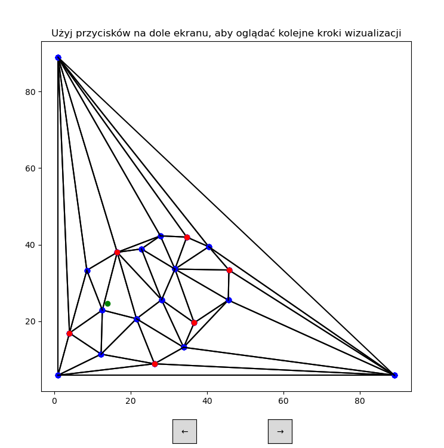

# Algorytm Kirkpatricka — aplikacja dydaktyczna
Projekt z przedmiotu "Algorytmy geometryczne" ([algorytm Kirkpatricka](https://ics.uci.edu/~goodrich/teach/geom/notes/Kirkpatrick.pdf)) realizowany w roku akademickim 2024/2025. 
Zawiera implementację algorytmu lokalizacji punktu w podziale poligonowym metodą coraz większych triangulacji. GUI przygotowane z wykorzystaniem biblioteki matplotlib.

## Zadawanie podziału poligonowego i poszukiwanego punktu
Aplikacja umożliwia zadanie podziału poligonowego i poszukiwanego punktu w graficzny sposób, jak również poprzez odczyt z pliku (kilka przykładowych plików znajduje się w folderze input_output_files).

## Przeglądanie kolejnych kroków działania algorytmu
Po zapisaniu podziału poligonowego aplikacja umożliwia przeglądanie kolejnych kroków działania algorytmu, w tym znajdowania zbioru niezależnych wierzchołków, kolejnych triangulacji, a po ich zakończeniu przeszukiwania powstałego grafu zależności między trójkątami.

